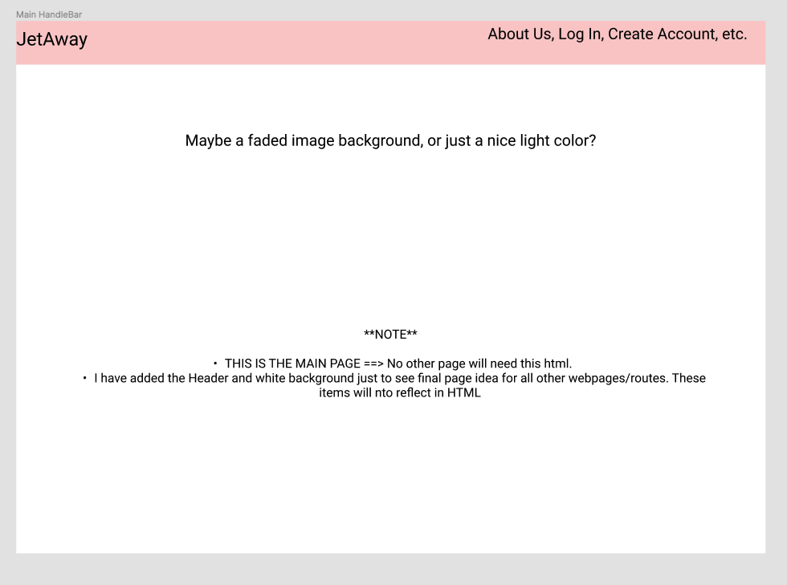
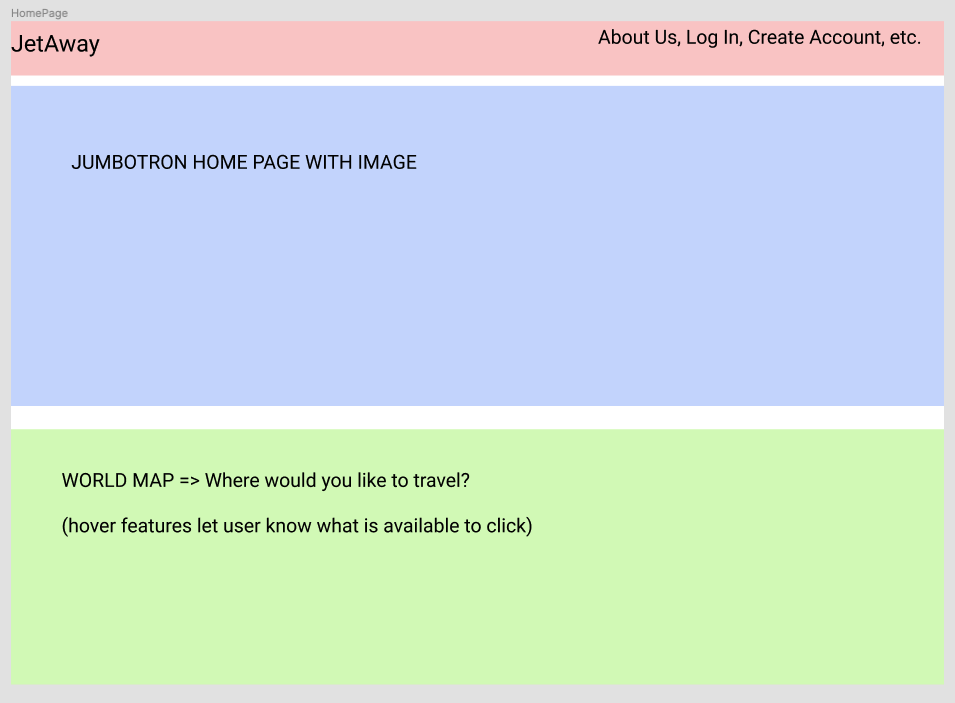
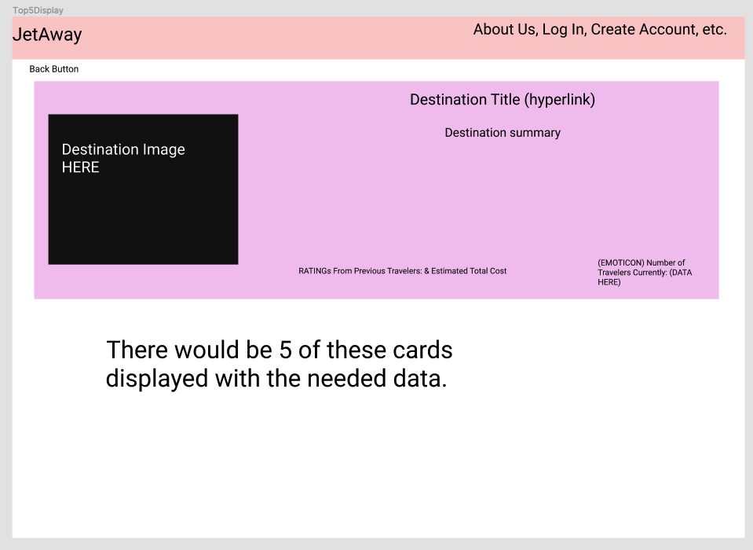
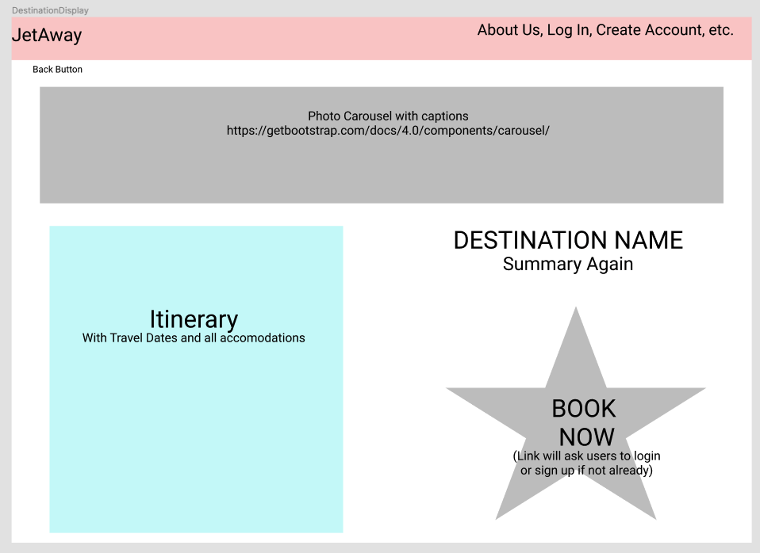
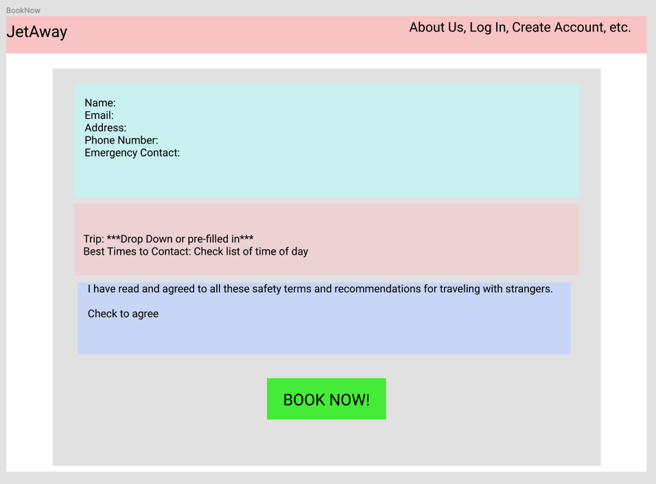

# Project 2 Proposal : JetAway 
Creators: Fatimah Grant, Mark June, Savannah Kolb, Summer Milner, Naomi Torres Serrano, & Carletta Walls
___

## Project Proposal:
JetAway is created for the jetsetters of the world. Those adventurers looking to meet new people while traveling to new places. 

This application is intended to allow users from all parts of the world to come together to create memories for life. 

Users are able to pick a continent they wish to travel, be directed to the top 5 best destinations within the chosen continent, be shown sample itineraries for each specific destination, and once the user has found their ideal adventure, they will be connected with fellow travelers and a top booking agency that will deliver the best prices for the most adventure and fun for the traveling group. The final step is to JetAway on their perfect adventure!

## Wire Frame:

Here is a basic layout for our application. 

<b> Main Handlebar:

<b> Homepage:

<b> Top 5 Destination Display:

<b> Destination Display:

<b> Book Now Form:

## Teams:

Front End: Fatimah, Savannah, and Carletta

Back End: Summer, Mark, and Naomi